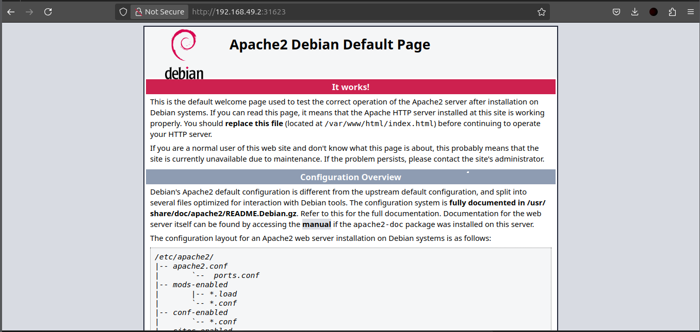
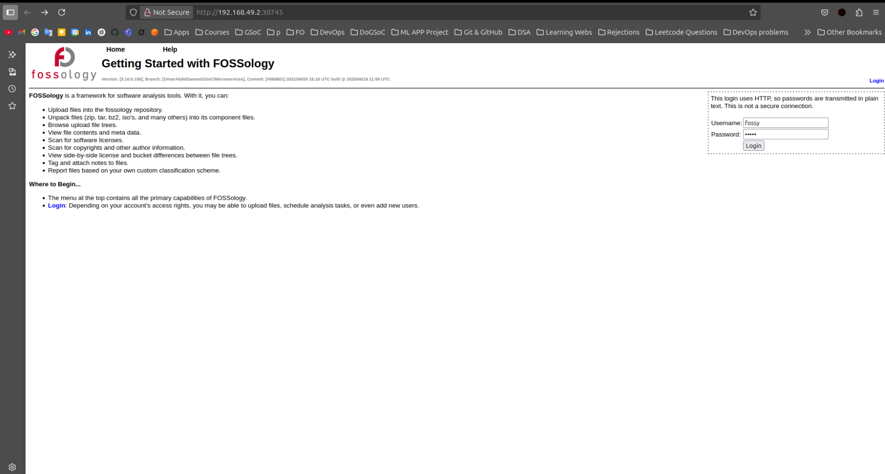
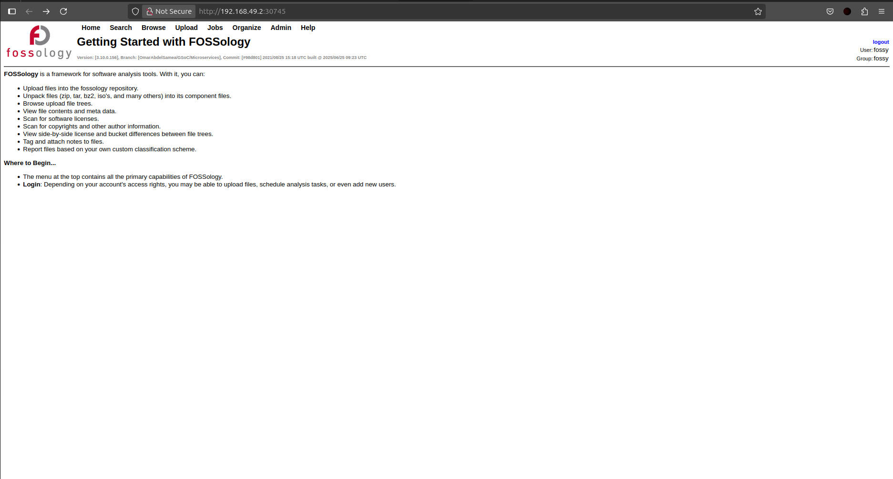
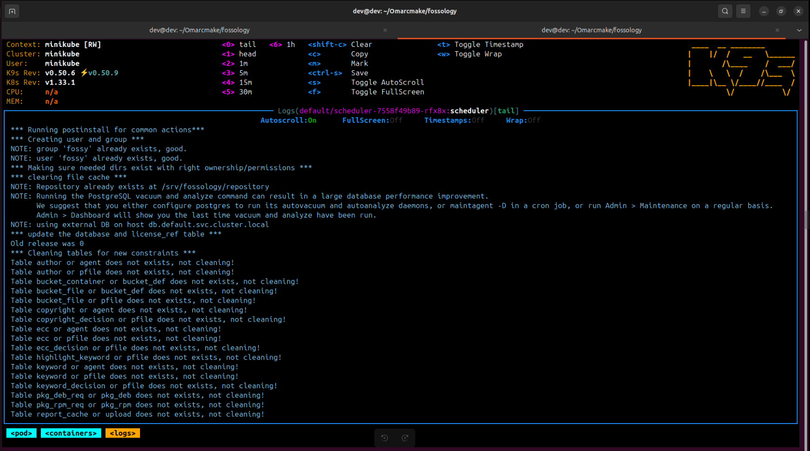
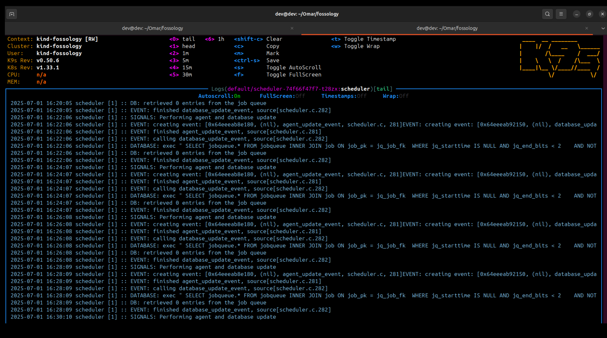
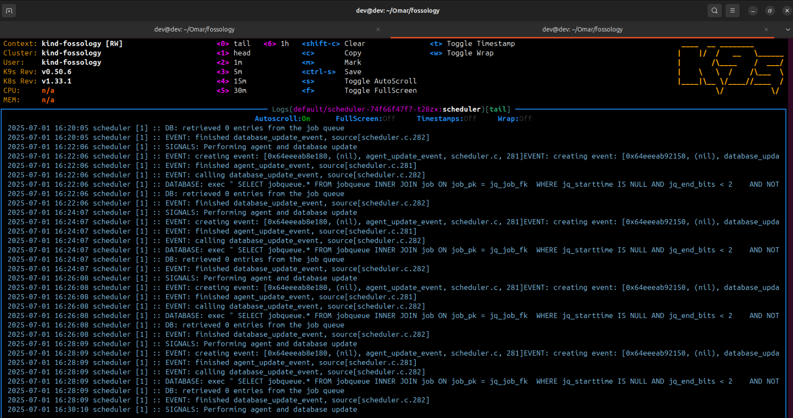
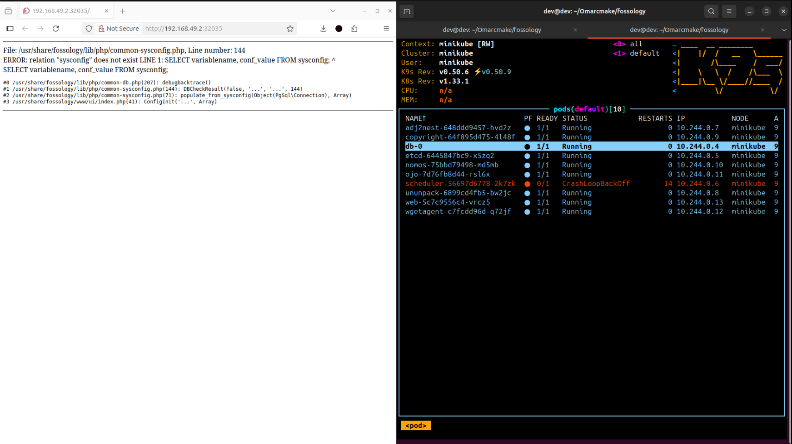
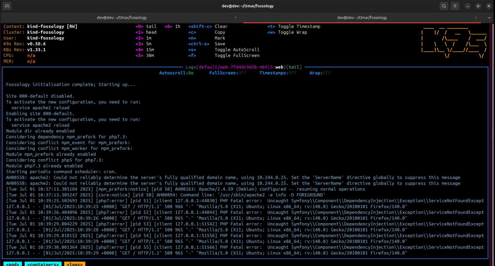

<h1 align="center">Google Summer of Code 2025 </h1> 

    

<h2><i>Complete Microservices Infrastructure
 @ <a href = "https://www.fossology.org/">FOSSology </a> </i></h2>

<h1 align = "center" id = "connections">Table of Contents </h1>

- [About FOSSology](#about-fossology)
- [Project Overview](#project-overview)
- [Project Goals](#project-goals)
- [Work Accomplished](#work-accomplished)
  - [Setup and Initial Configuration](#setup-and-initial-configuration)
  - [Docker and Kubernetes Enhancements](#docker-and-kubernetes-enhancements)
  - [Transition to CMake](#transition-to-cmake)
  - [Scheduler Agent Development](#scheduler-agent-development)
  - [Kustomization Setup](#kustomization-setup)
  - [Database and Web Pod Fixes](#database-and-web-pod-fixes)
- [Challenges and Blockers](#challenges-and-blockers)
  - [Scheduler Instability](#scheduler-instability)
  - [Database Migration Issues](#database-migration-issues)
  - [Dependency and Configuration Conflicts](#dependency-and-configuration-conflicts)
- [Unfulfilled Objectives](#unfulfilled-objectives)
- [Future Work](#future-work)
- [Commits and Contributions](#commits-and-contributions)
- [Acknowledgements](#acknowledgements)

<h1 align = "center" id = "connections">About FOSSology </h1>

FOSSology is an open-source compliance toolset that provides license and copyright
discovery. It offers a framework for software analysis and includes tools that enable users to
discover licenses and copyrights, parse package files, and categorize files and packages.
FOSSology operates as a client-server application with a web-based front end, simplifying
tasks such as uploading files or package archives and scheduling analysis jobs. The server
efficiently scans through thousands of files, logging copyright statements, license statements,
and other metadata.
With its combination of a command-line toolkit and a web-based compliance workflow,
FOSSology helps organizations manage software license and copyright compliance. It offers
flexibility and convenience, making it a powerful tool for software analysis and compliance
management.

<h1 align = "center" id = "connections">Project Overview </h1>

The goal of my **Google Summer of Code 2025** project was to advance the **Microservices Infrastructure of FOSSology** by rebasing and enhancing Omar AbdelSamea’s prior  of **2021**, addressing issues in the Kubernetes-based deployment, transitioning the build system from Make to CMake and resolving critical blockers such as scheduler and database connectivity issues. The project aimed to deliver a functional, maintainable and scalable microservices setup for FOSSology, ensuring that all components (web, scheduler, database and agents) work seamlessly in a containerized environment.

Throughout the 13-week period, I collaborated closely with mentors [Avinal Kumar](https://github.com/avinal), [Shaheem Azmal M MD](https://github.com/shaheemazmalmmd) and [Gaurav Mishra](https://github.com/gmishx), as well as the broader FOSSology community, to troubleshoot issues, refine configurations and document progress. While significant progress was made, certain challenges, particularly around the scheduler agent, remain unresolved and will require further effort beyond GSoC.

<h1 align = "center" id = "connections">Project Goals </h1>

- **Rebase and Update Microservices Architecture**: Integrate Omar AbdelSamea’s GSoC 2021 microservices work with the latest FOSSology master branch.
- **Resolve Deployment Issues**: Fix Docker build errors, Kubernetes pod crashes and database connectivity problems.
- **Transition to CMake**: Migrate the build system from Make to CMake for better maintainability and scalability.
- **Stabilize Scheduler Agent**: Ensure the scheduler pod, a critical component for coordinating agents, runs reliably.
- **Document Progress and Issues**: Provide comprehensive documentation for the final evaluation, outlining accomplishments, challenges, and unresolved issues.

<h1 align = "center" id = "connections">Work Accomplished </h1>

### Setup and Initial Configuration
- Set up a local development environment on Ubuntu 24.04 using Docker (v27.5.1), Minikube and kubectl.
- Cloned and rebased Omar AbdelSamea’s microservices branch  onto the latest FOSSology codebase.
- Resolved initial Docker build errors by updating `debian/changelog`, `Dockerfile.pkg`, and `fo-build` to address dependency issues.
- Fixed etcd pod issues by switching to version `v3.5.15` and reloading images into Minikube.
- Addressed Kubernetes API issues (e.g., "no route to host") through Minikube restarts.

### Docker and Kubernetes Enhancements
- Successfully built and tested Docker images for key components: `packages`, `scheduler`, `web`, `ununpack`, `wget_agent`, `nomos`, `copyright`, and `ojo`.
- Fixed the web UI issue where the default Apache2 Debian page was displayed instead of the FOSSology interface by correcting file paths in the web Dockerfile.

- Switched from Minikube to Kind for faster and more stable local development, then reverted to Minikube due to Kind’s limitations (e.g., unreliable port handling).

- Added Dockerfiles and Kubernetes configurations for missing agents (`cyclonedx`, `delagent`, `readmeoss`, `scanoss`) to ensure complete infrastructure coverage.
- Updated Kubernetes manifests (e.g., `20-web-deployment.yaml`) with a `wait-for-db` section to ensure proper startup order for the web pod.

### Transition to CMake
- Migrated the build system from Make to CMake to improve maintainability and flexibility.
- Created a dedicated build folder for scalable Kubernetes configuration management system using Kustomization.
uccessfully built most components using CMake, except for the scheduler, which faced database-related issues.
- Ensured compatibility of the CMake setup with Dockerfiles and Kubernetes configurations.

### Scheduler Agent Development
- Addressed the scheduler pod’s `CrashLoopBackOff` issue caused by a PostgreSQL error (`tables can have at most 1600 columns`) by resetting the database and updating configurations.

- Partially stabilized the scheduler pod through iterative debugging, log analysis and changes to `docker-entrypoint.k8s.sh` and `php-conf-fix.sh`.
- Implemented a curl-based approach for the scheduler to track agent availability, as decided in collaboration with mentors.
- Investigated path mismatches for `fo_scheduler` and explored evaluation metrics (e.g., job queue performance, agent execution times).

### Kustomization Setup
- Developed a Kustomization structure for managing Kubernetes YAMLs, including `base/` and `overlays/` (dev and prod) directories.
- Ensured scalability and maintainability of Kubernetes configurations for future development.

### Database and Web Pod Fixes
- Fixed database connectivity issues by verifying PostgreSQL functionality locally (`psql -h localhost -p 5432 -U fossy`) and within containers.
- Added missing database columns (`create_sysconfig.sql`, `create_uploadtree.sql`, `populate_sysconfig.sql`, `additional_tables.sql`, `create_additional_tables.sql`) to resolve web agent errors.

- Configured readiness probes (`pg_isready`) and increased init script delays to stabilize database startup.
- Partially resolved web pod connectivity issues, though full integration with the scheduler remains incomplete.

<h1 align = "center" id = "connections">Challenges and Blockers </h1>

### Scheduler Instability
- **Issue**: The scheduler pod, critical for coordinating agents like `ojo`, `nomos`, and `web`, remains partially functional despite extensive debugging. It suffers from intermittent crashes and connectivity issues.
- **Impact**: Dependent agents cannot operate reliably, and the FOSSology UI occasionally fails to load due to scheduler-related errors.
- **Attempts to Resolve**: Updated `docker-entrypoint.k8s.sh`, `php-conf-fix.sh`, and Kubernetes configurations; explored curl-based and shared volume approaches; reset database and PVCs; analyzed logs for errors.
- **Status**: The scheduler is partially running but not fully stable. A potential rebuild from scratch is under consideration, pending mentor approval.

### Database Migration Issues
- **Issue**: The latest master branch introduced database migration issues, causing schema incompatibilities and errors during updates (e.g., missing columns, PostgreSQL startup failures).
- **Impact**: Prevents seamless interaction between the web pod and database, resulting in UI errors like “Could not connect to FOSSology database.”
- **Attempts to Resolve**: Added missing columns, reset database and PVCs, verified local PostgreSQL connectivity and adjusted Kubernetes service configurations.
- **Status**: Partially resolved, but issues persist with the latest branch migrations.

### Dependency and Configuration Conflicts
- **Issue**: Compatibility issues arose when switching from `buster-slim` to `bookworm-slim` and during rebasing with the master branch, leading to build failures and missing dependencies (e.g., `libcurl4-openssl-dev` for scheduler).
- **Impact**: Delayed progress and required rollbacks to maintain stability.
- **Attempts to Resolve**: Updated `debian/changelog`, Dockerfiles and dependency lists; rolled back to `buster-slim` temporarily; synced `src/` folder with master branch changes.
- **Status**: Most build issues resolved, but ongoing refinement of Dockerfiles is needed for long-term maintainability.

<h1 align = "center" id = "connections">Unfulfilled Objectives </h1>

- **Fully Functional Scheduler**: The scheduler pod is not fully stable, preventing dependent agents from operating reliably. A complete fix or rebuild is required.
- **Complete Database Integration**: Persistent database connectivity issues with the web pod and schema migrations from the latest master branch remain unresolved.
- **Simplified Dockerfiles**: While progress was made, the Dockerfiles still require simplification to reduce complexity and improve maintainability.
- **Full Agent Integration**: Agents like `cyclonedx`, `delagent`, `readmeoss`, and `scanoss` have Dockerfiles and Kubernetes configurations but lack full integration due to scheduler issues.
- **Evaluation Metrics**: Lack of clarity on metrics (e.g., job queue performance, resource usage) for evaluating the scheduler in a containerized setup.

<h1 align = "center" id = "connections">Future Work </h1>

Although the GSoC 2025 period has concluded, I am committed to continuing my contributions to FOSSology. The following tasks are planned:
- **Stabilize the Scheduler**: Finalize the scheduler pod by resolving remaining issues or rebuilding it from scratch, based on mentor guidance.
- **Resolve Database Issues**: Address schema migration problems and ensure seamless connectivity between the web pod and database.
- **Optimize Dockerfiles**: Simplify and streamline Dockerfiles for all components to improve build efficiency and maintainability.
- **Collaborate with Community**: Work with mentors and contributors, including reaching out to Omar AbdelSamea, to align on solutions and incorporate past insights.

<h1 align = "center" id = "connections">Commits and Contributions </h1>

Key commits made during GSoC 2025:
- **Initial Setup and Fixes**: [Commit 1af934a](https://github.com/SalmanDeveloperz/fossology/commit/1af934a48c449a2aacdb3bdec285a79534488db4)
  - Polished Dockerfiles and Kubernetes manifests.
  - Fixed web and scheduler pod configurations.
  - Added init containers for PostgreSQL readiness.
- **Scheduler and Database Fixes**: [Commit 440f907](https://github.com/SalmanDeveloperz/fossology/commit/440f9077c7fdaafec82b3647e8759a683cb38a16)
  - Resolved `CrashLoopBackOff` for scheduler pod.
  - Added missing database columns and updated configurations.

- **Update deps aligned with master**: [Commit 4fd4787](https://github.com/SalmanDeveloperz/fossology/commit/4fd4787936081c0c8db7df8e40d57e76e123a51a)
  - Migrate from Make to CMake
  - Update dependencies
  - Added missing agent dockerfiles/deployment
  - Aligned with master
  - Partially Running Scheduler Agent

- **Ongoing Work**: Contributions to `src/` folder, Dockerfiles for missing agents and Kustomization setup are available in the [OmarAbdelSamea/GSoC/Microservices](https://github.com/SalmanDeveloperz/fossology/tree/OmarAbdelSamea/GSoC/Microservices) branch.

All changes are pushed to my forked repository: [SalmanDeveloperz/fossology](https://github.com/SalmanDeveloperz/fossology).

<h1 align = "center" id = "connections">Documentation </h1>

Throughout the 13 weeks of the GSoC period, I consistently created weekly documentation to track and record my progress. Week-wise documentation can be found in the following links:

- [Community Bonding](https://github.com/fossology/gsoc/pull/300)
- [Week 1](https://github.com/fossology/gsoc/pull/314)
- [Week 2](https://github.com/fossology/gsoc/pull/319)
- [Week 3](https://github.com/fossology/gsoc/pull/327)
- [Week 4](https://github.com/fossology/gsoc/pull/330)
- [Week 5](https://github.com/fossology/gsoc/pull/340)
- [Week 6](https://github.com/fossology/gsoc/pull/346)
- [Week 7](https://github.com/fossology/gsoc/pull/349)
- [Week 8](https://github.com/fossology/gsoc/pull/355)
- [Week 9](https://github.com/fossology/gsoc/pull/364)
- [Week 10](https://github.com/fossology/gsoc/pull/365)
- [Week 11](https://github.com/fossology/gsoc/pull/371)
- [Week 12](https://github.com/fossology/gsoc/pull/372)
- [Week 13](https://github.com/fossology/gsoc/pull/373)

<h1 align = "center" id = "connections">Acknowledgements </h1>

I am deeply grateful to my mentors, [Avinal Kumar](https://github.com/avinal), [Shaheem Azmal M MD](https://github.com/shaheemazmalmmd) and [Gaurav Mishra](https://github.com/gmishx), for their guidance, patience, and technical insights throughout the GSoC period. Their feedback during weekly calls and community meetings was invaluable in navigating complex challenges. I also thank the FOSSology community for their support and suggestions, and Google Summer of Code for providing this incredible opportunity.

This GSoC journey has been a tremendous learning experience, enhancing my skills in Docker, Kubernetes, CMake and open-source collaboration. While the project is not fully complete, I am excited to continue contributing to FOSSology and driving the Microservices Infrastructure to a stable.

---
<h1 align = "center" id = "connections">Let's connect! </h1>

-   [Mail](chsalmanramzan422@gmail.com)
-   [LinkedIn](https://www.linkedin.com/in/msalman199/)
-   [GitHub](https://github.com/SalmanDeveloperz)
---

  
  

